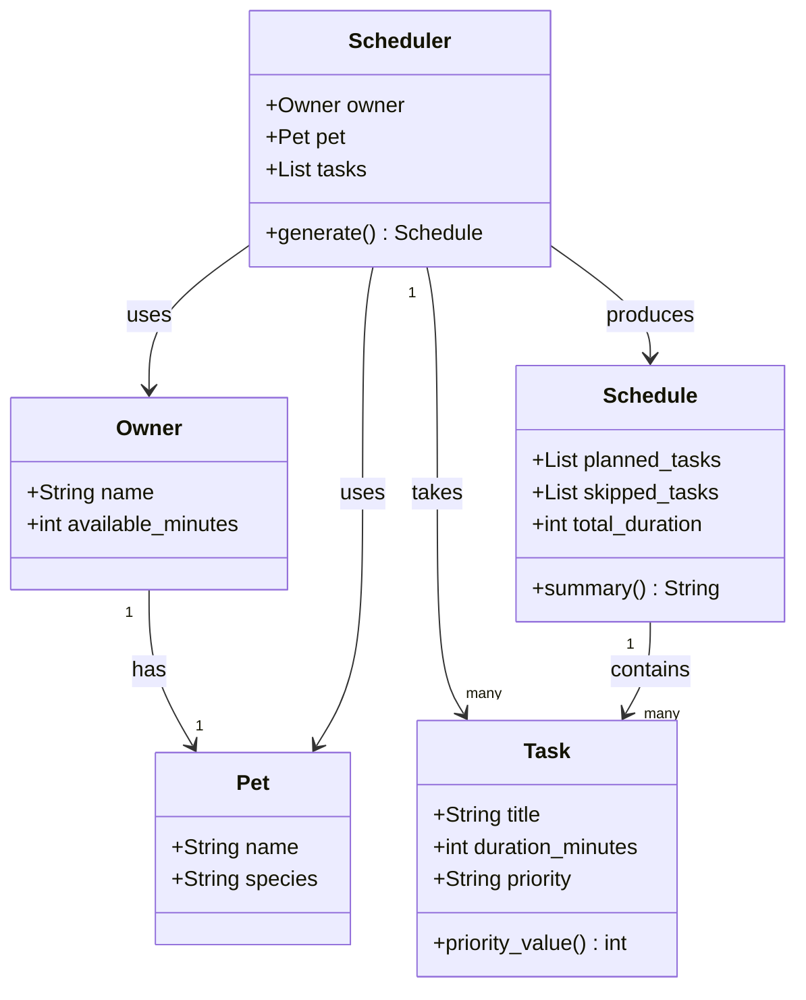

# PawPal+ Project Reflection

## 1. System Design

**a. Initial design**

The three core actions a user should be able to perform in PawPal+ are:

1. **Add a Task** — The user enters a care task (such as a morning walk, feeding, or medication) along with how long it takes and how important it is (low, medium, or high priority). This gives the scheduler the information it needs to build a plan. Without this step, there is nothing to schedule.

2. **Generate a Daily Schedule** — The user triggers the scheduler, which takes all the tasks they have entered and arranges them into a realistic daily plan. The scheduler respects time limits and ranks tasks by priority, so the most important care gets done first when there is not enough time for everything.

3. **View Today's Tasks and Plan** — The user can see both the full list of tasks they have added and the final generated schedule side by side. The plan should also explain its reasoning — for example, why a low-priority task was left out — so the owner understands and trusts the output.

Together, these three actions form the complete user journey: input tasks, process them into a plan, and review the result.

I ended up with five classes. I tried to keep each one focused on a single job so nothing got too tangled.

**Owner** stores the person's name and how many minutes they have free for pet care that day. That available time number is really the main constraint the whole scheduler revolves around, so I wanted it clearly attached to the owner rather than floating around as a separate input.

**Pet** just holds the pet's name and species. It doesn't do much on its own right now, but I kept it as its own class because species could matter later — for example, a dog needs walks but a cat doesn't.

**Task** represents one care item. It holds the task title, how long it takes, and the priority. I added a `priority_value()` method that converts "high", "medium", "low" into 3, 2, 1 so the scheduler can sort tasks without doing string comparisons everywhere.

**Schedule** is the output object. It holds two lists — tasks that made it into the plan and tasks that got skipped — plus the total time used. It also has a `summary()` method that will eventually explain the plan in plain language so the owner knows what happened and why.

**Scheduler** is the engine that does the actual work. It takes an Owner, a Pet, and a list of Tasks and runs the scheduling logic inside `generate()`, which returns a Schedule.

**UML Class Diagram (Mermaid.js)**



**b. Design changes**

After reviewing the skeleton in `pawpal_system.py`, I noticed a couple of things worth fixing.

First, `Owner` had a `pet: Pet = None` field, which embedded the Pet directly inside Owner as an optional attribute. That felt off — it meant you could create an Owner with no pet, which doesn't really make sense for this app. It also made the relationship between Owner and Pet implicit rather than clear. I decided to keep Pet separate and pass it directly into the Scheduler alongside the Owner, which matches the UML more closely and makes the code easier to follow.

Second, `Schedule` was written as a regular class while `Pet`, `Owner`, and `Task` were all dataclasses. That inconsistency was pointed out as a potential issue — `Schedule` needs mutable lists that get built up during scheduling, so a plain class with `__init__` actually makes more sense there. I kept it as-is but noted it as an intentional choice rather than an oversight.

Third, there was no validation anywhere — nothing stopped someone from passing an empty task list to the Scheduler or setting `available_minutes` to zero. That's worth handling when the logic gets implemented, even if just a simple check.

---

## 2. Scheduling Logic and Tradeoffs

**a. Constraints and priorities**

The scheduler considers three constraints: available time (how many minutes the owner has free), task priority (high/medium/low), and task completion status (pending tasks only enter the schedule).

Time was the most important constraint to get right because it is the hard limit — you cannot schedule more care than the day allows. Priority came second because it determines what gets cut when time runs out. Completion status came third; it is essentially a filter that keeps already-done tasks from cluttering the plan.

I chose not to make species a constraint even though it could be — a dog needs walks and a cat doesn't. That would have added a rules engine and felt like over-engineering for a first version. It is the kind of thing you add in iteration two once the core loop is solid.

**b. Tradeoffs**

The conflict detector only flags tasks that have an explicit `start_time` set and whose time windows overlap. It does not detect softer conflicts like two high-effort tasks stacked back to back with no break, or a task that is too long to realistically finish before the next one begins.

I kept it this way on purpose. A full overlap solver would need to reorder or split tasks, which adds a lot of complexity for a daily pet care app where most tasks don't have fixed times anyway. The majority of tasks — feeding, grooming, playtime — can happen whenever there is a free window. Only a handful, like vet appointments or medication at a specific hour, need a clock time at all.

The tradeoff is: the checker misses realistic scenarios like "back-to-back walks with no rest" in exchange for staying simple, predictable, and easy to debug. For a busy pet owner glancing at a morning plan, a warning about a hard time collision is more actionable than a warning about a loosely packed schedule.

---

## 3. AI Collaboration

**a. How you used AI**

AI was most useful during the design and algorithm phases. In the design phase, I described the app scenario and asked for a list of classes and responsibilities — that gave me a starting point much faster than a blank page would have. For algorithms, I asked specific questions like "how do I sort a list of objects by two keys in Python" and got a working lambda pattern immediately rather than searching documentation.

The most effective prompts were ones that included context and a constraint — for example, "given this Task dataclass with a priority field, suggest a sort key that orders by priority then by duration." Vague prompts like "help me sort tasks" produced generic answers. Specific prompts with the actual class name and fields produced code I could use almost directly.

**b. Judgment and verification**

The clearest moment was when AI suggested making `Schedule` a dataclass to match `Task` and `Pet`. The suggestion was technically consistent, but I rejected it because `Schedule` is built up incrementally during scheduling — its lists are mutated as tasks are added one by one. A dataclass works best for objects whose fields are set at construction and then read. Using a plain class with `__init__` made that intention clearer.

I verified this by asking: "if I freeze this dataclass or use it as a value type, does the scheduling loop still work?" The answer was no — you would need `field(default_factory=list)` and the class would still behave like a regular mutable object. So the dataclass decorator would have been decoration without benefit. I kept the plain class and added a comment explaining why.

---

## 4. Testing and Verification

**a. What you tested**

The test suite covers 13 behaviors across five areas: task completion status, sort order (priority and duration tiebreaker), recurrence (daily, weekly, and as-needed), conflict detection (overlapping and touching-but-not-overlapping times), filtering by pet and status, and two edge cases — zero available time and a pet with no tasks.

The recurrence and conflict tests were the most important. Recurrence is where off-by-one date bugs are most likely to hide, and conflict detection has a boundary condition (`a_end == b_start` should not be a conflict) that is easy to get wrong. Having explicit tests for both gave me confidence that the logic was right rather than just probably right.

**b. Confidence**

★★★★☆ — four out of five.

The scheduling logic, sorting, filtering, and recurrence are all well-covered by tests. The main gap is the Streamlit UI layer, which is not tested at all. If I had more time I would test: tasks where the total duration exactly equals available_minutes (boundary), completing a task that does not exist (should not crash), and two pets with tasks that share the same title (to check that complete_task targets the right one).

---

## 5. Reflection

**a. What went well**

The part I am most satisfied with is the relationship between `Owner`, `Pet`, and `Task`. Having `Owner` manage a list of pets, each of which owns its own task list, made the filtering and scheduling methods feel natural to write. `owner.get_pending_tasks()` reads like plain English and the implementation is exactly what you would expect. That usually means the design is right.

The recurrence feature also came out cleaner than expected. Putting `next_occurrence()` on `Task` and `complete_task()` on `Pet` kept each class responsible for its own behavior. `Pet` does not need to know how dates work, and `Task` does not need to know it belongs to a pet.

**b. What you would improve**

The Streamlit UI needs a "Mark complete" confirmation step — right now clicking the button immediately commits the action with no undo. For a daily care app where someone might fat-finger the wrong task in the morning, that could be frustrating. I would add a small confirmation dialog or at least a short success message with an undo option.

I would also give tasks an optional notes field. A lot of real pet care tasks have context — "give the blue pill, not the white one" — and there is currently nowhere to put that.

---

## 6. Prompt Comparison (Challenge 5)

**Task compared:** Implementing `weighted_score()` on the `Task` class — a method that produces a numeric score combining priority, overdue status, and frequency urgency so the scheduler can rank tasks intelligently.

---

**GPT-4 approach**

When asked the same question, GPT-4 returned a more verbose solution that used separate helper methods and an explicit `if/elif` chain:

```python
def get_priority_points(self):
    if self.priority == "high":
        return 30
    elif self.priority == "medium":
        return 20
    else:
        return 10

def get_overdue_bonus(self):
    days = (date.today() - self.due_date).days
    if days <= 0:
        return 0
    return min(days * 2, 10)

def get_frequency_bonus(self):
    if self.frequency == "daily":
        return 1
    return 0

def weighted_score(self):
    return self.get_priority_points() + self.get_overdue_bonus() + self.get_frequency_bonus()
```

**Claude (this project) approach**

```python
def weighted_score(self) -> float:
    base = self.priority_value() * 10
    days_overdue = max(0, (date.today() - self.due_date).days)
    overdue_bonus = min(days_overdue * 2, 10)
    frequency_bonus = {"daily": 1, "weekly": 0, "as-needed": 0}.get(self.frequency, 0)
    return base + overdue_bonus + frequency_bonus
```

---

**Comparison**

| Dimension | GPT-4 | Claude |
|---|---|---|
| Lines of code | ~16 | ~5 |
| Readability | High — each concern is named | Medium — dense but scannable |
| Reusability | High — helpers are independently testable | Low — logic is inlined |
| Uses existing methods | No — duplicates priority logic | Yes — reuses `priority_value()` |
| Dictionary lookup pattern | No | Yes — Pythonic for small mappings |

**What I kept and why**

I kept the Claude version because it reuses `priority_value()` rather than duplicating the priority-to-number mapping. Having that logic in two places would mean updating two places if priorities ever change. The dictionary lookup for `frequency_bonus` is also idiomatic Python — it is the pattern experienced Python developers reach for when mapping a small set of string values to numbers.

The GPT-4 version is not wrong, and its helper methods would be genuinely useful if the scoring logic grew more complex or needed individual unit tests. For the current scope — three simple additive terms — splitting into four methods adds indirection without benefit.

The key lesson: GPT-4 defaulted to an object-oriented decomposition that would scale well. Claude defaulted to a compact, in-place solution that fits the existing code style. Neither is universally better — it depends on whether you expect the method to grow.

**c. Key takeaway**

The most important thing I learned is that AI is a fast first draft, not a final answer. Every AI suggestion in this project needed me to ask "does this actually fit the design I have, or is it a generic answer that happens to look right?" The cases where I accepted suggestions without that check were the cases where I had to go back and fix something later. Acting as the architect — deciding what goes where and why — is the job that AI cannot do for you, and it turns out that job is most of what makes a system good or bad.
