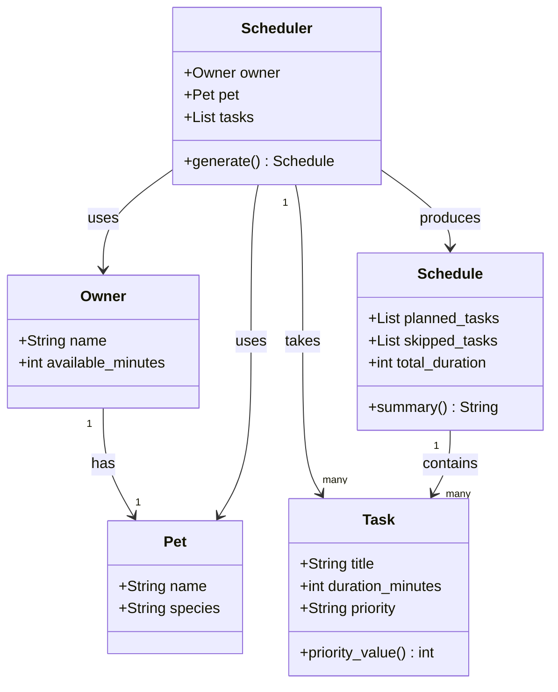

# PawPal+ Project Reflection

## 1. System Design

**a. Initial design**

The three core actions a user should be able to perform in PawPal+ are:

1. **Add a Task** — The user enters a care task (such as a morning walk, feeding, or medication) along with how long it takes and how important it is (low, medium, or high priority). This gives the scheduler the information it needs to build a plan. Without this step, there is nothing to schedule.

2. **Generate a Daily Schedule** — The user triggers the scheduler, which takes all the tasks they have entered and arranges them into a realistic daily plan. The scheduler respects time limits and ranks tasks by priority, so the most important care gets done first when there is not enough time for everything.

3. **View Today's Tasks and Plan** — The user can see both the full list of tasks they have added and the final generated schedule side by side. The plan should also explain its reasoning — for example, why a low-priority task was left out — so the owner understands and trusts the output.

Together, these three actions form the complete user journey: input tasks, process them into a plan, and review the result.

I ended up with five classes. I tried to keep each one focused on a single job so nothing got too tangled.

**Owner** stores the person's name and how many minutes they have free for pet care that day. That available time number is really the main constraint the whole scheduler revolves around, so I wanted it clearly attached to the owner rather than floating around as a separate input.

**Pet** just holds the pet's name and species. It doesn't do much on its own right now, but I kept it as its own class because species could matter later — for example, a dog needs walks but a cat doesn't.

**Task** represents one care item. It holds the task title, how long it takes, and the priority. I added a `priority_value()` method that converts "high", "medium", "low" into 3, 2, 1 so the scheduler can sort tasks without doing string comparisons everywhere.

**Schedule** is the output object. It holds two lists — tasks that made it into the plan and tasks that got skipped — plus the total time used. It also has a `summary()` method that will eventually explain the plan in plain language so the owner knows what happened and why.

**Scheduler** is the engine that does the actual work. It takes an Owner, a Pet, and a list of Tasks and runs the scheduling logic inside `generate()`, which returns a Schedule.

**UML Class Diagram (Mermaid.js)**

**b. Design changes**

After reviewing the skeleton in `pawpal_system.py`, I noticed a couple of things worth fixing.

First, `Owner` had a `pet: Pet = None` field, which embedded the Pet directly inside Owner as an optional attribute. That felt off — it meant you could create an Owner with no pet, which doesn't really make sense for this app. It also made the relationship between Owner and Pet implicit rather than clear. I decided to keep Pet separate and pass it directly into the Scheduler alongside the Owner, which matches the UML more closely and makes the code easier to follow.

Second, `Schedule` was written as a regular class while `Pet`, `Owner`, and `Task` were all dataclasses. That inconsistency was pointed out as a potential issue — `Schedule` needs mutable lists that get built up during scheduling, so a plain class with `__init__` actually makes more sense there. I kept it as-is but noted it as an intentional choice rather than an oversight.

Third, there was no validation anywhere — nothing stopped someone from passing an empty task list to the Scheduler or setting `available_minutes` to zero. That's worth handling when the logic gets implemented, even if just a simple check.

---

## 2. Scheduling Logic and Tradeoffs

**a. Constraints and priorities**

- What constraints does your scheduler consider (for example: time, priority, preferences)?
- How did you decide which constraints mattered most?

**b. Tradeoffs**

The conflict detector only flags tasks that have an explicit `start_time` set and whose time windows overlap. It does not detect softer conflicts like two high-effort tasks stacked back to back with no break, or a task that is too long to realistically finish before the next one begins.

I kept it this way on purpose. A full overlap solver would need to reorder or split tasks, which adds a lot of complexity for a daily pet care app where most tasks don't have fixed times anyway. The majority of tasks — feeding, grooming, playtime — can happen whenever there is a free window. Only a handful, like vet appointments or medication at a specific hour, need a clock time at all.

The tradeoff is: the checker misses realistic scenarios like "back-to-back walks with no rest" in exchange for staying simple, predictable, and easy to debug. For a busy pet owner glancing at a morning plan, a warning about a hard time collision is more actionable than a warning about a loosely packed schedule.

---

## 3. AI Collaboration

**a. How you used AI**

- How did you use AI tools during this project (for example: design brainstorming, debugging, refactoring)?
- What kinds of prompts or questions were most helpful?

**b. Judgment and verification**

- Describe one moment where you did not accept an AI suggestion as-is.
- How did you evaluate or verify what the AI suggested?

---

## 4. Testing and Verification

**a. What you tested**

- What behaviors did you test?
- Why were these tests important?

**b. Confidence**

- How confident are you that your scheduler works correctly?
- What edge cases would you test next if you had more time?

---

## 5. Reflection

**a. What went well**

- What part of this project are you most satisfied with?

**b. What you would improve**

- If you had another iteration, what would you improve or redesign?

**c. Key takeaway**

- What is one important thing you learned about designing systems or working with AI on this project?
